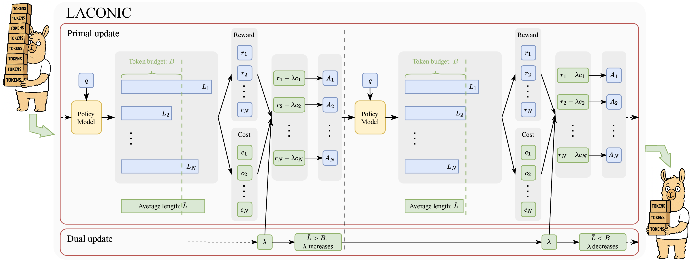

# LACONIC: Length-Aware Constrained Reinforcement Learning for LLMs

[](https://arxiv.org/abs/2602.14468)
[](https://github.com/Debugger001/LACONIC-LLM)
[](./LICENSE)

Official implementation of **LACONIC**, a length-aware reinforcement learning method for making LLM responses substantially shorter while preserving task performance.

This repository includes the training, evaluation, and checkpoint export code for **LACONIC**. It is meant both to support reproduction of the paper and to serve as a practical reference for anyone who wants to use LACONIC-style training to control response length in their own RL pipelines.

- **Method:** LACONIC enforces a target token budget during training by combining task reward with an adaptive length-based cost.
- **Effect:** it makes responses substantially shorter while preserving task performance, with the usual decoding stack at deployment time.
- **Headline result:** on mathematical reasoning, LACONIC preserves or improves `pass@1` while reducing output length by **over 50%**; on general knowledge and multilingual benchmarks, it maintains out-of-domain performance with **44% fewer tokens**.

## 🔗 Quick Links

📄 [Paper](https://arxiv.org/abs/2602.14468) · 💻 [Code](https://github.com/Debugger001/LACONIC-LLM) · 🤗 [Hugging Face org](https://huggingface.co/laconic-llm) · More releases coming soon

## ✨ Key Features

- **🧠 Adaptive length control:** LACONIC uses a budget-aware penalty that is adjusted online during RL training.
- **📉 Large token savings:** it can substantially reduce response length while preserving task performance.
- **🚀 Standard deployment:** the trained model uses the usual decoding stack, with no inference-time control logic required.

## 🧭 Contents

- [❓ Why LACONIC](#why-laconic)
- [📈 Headline Results](#headline-results)
- [⚙️ How LACONIC Works](#how-laconic-works)
- [🧩 LACONIC Is Easy To Implement And Deploy](#laconic-is-easy-to-implement-and-deploy)
- [🚀 Quick Start](#quick-start)
- [🗂️ Repository Guide](#repository-guide)
- [🧾 Data And Prompting](#data-and-prompting)
- [🤗 Model Releases](#planned-model-releases)
- [📚 Citation](#citation)

<a id="why-laconic"></a>
## ❓ Why LACONIC

Reinforcement learning often improves reasoning performance, but it also tends to make responses much longer. Those extra tokens increase latency and serving cost.

LACONIC addresses that tradeoff during RL training by keeping the usual task reward while adding an adaptive cost for overlong outputs. In practice, **LACONIC significantly reduces response length while preserving task performance.**

The practical benefits are immediate:

- shorter outputs mean lower inference latency
- shorter outputs mean lower serving cost
- controlling length during training is simpler than relying on brittle decoding-time heuristics
- the method fits naturally into standard RL fine-tuning pipelines

<a id="headline-results"></a>
## 📈 Headline Results

| Setting | Main Outcome |
| --- | --- |
| Mathematical reasoning | Preserves or improves `pass@1` while reducing output length by **over 50%** |
| General knowledge + multilingual | Maintains out-of-domain performance with **44% fewer tokens** |
| Deployment | Requires **no inference-time changes** and adds minimal serving overhead |

Paper link: [arXiv:2602.14468](https://arxiv.org/abs/2602.14468)

<a id="how-laconic-works"></a>
## ⚙️ How LACONIC Works

LACONIC adds a length-aware cost during RL training and adapts its strength online. For a response of length $L$ and a target budget $B$, it computes:

$$
\tilde r = r_{\text{task}} - \lambda c_{\text{len}}
$$

$$
c_{\text{len}} = \max\left(0, \frac{L-B}{B}\right)
$$

$$
\bar L > B \Rightarrow \lambda \text{ increases}, \qquad
\bar L < B \Rightarrow \lambda \text{ decreases}
$$

Here, $c_{\text{len}}$ is zero for responses that stay within budget and grows only when the response exceeds the budget. The multiplier $\lambda$ is updated from the batch-average response length $\bar L$, so the penalty becomes stronger when outputs are too long and relaxes when they are already short enough.

In practice, this is a simple feedback loop: LACONIC keeps the original task reward, penalizes only excess length, and automatically tunes the penalty scale to keep generations near the desired budget.

<p align="center">
  
</p>
<p align="center"><em>Full training overview from the paper. At a high level, LACONIC combines task reward with a length-based cost and updates a single dual variable to keep average response length near the target budget.</em></p>

<a id="laconic-is-easy-to-implement-and-deploy"></a>
## 🧩 LACONIC Is Easy To Implement And Deploy

LACONIC plugs into a standard RL-tuning pipeline with very little extra machinery.

- **No special model components:** LACONIC does not require a new head, controller, or auxiliary model.
- **Standard deployment path:** once training is done, inference uses the usual decoding stack.
- **Minimal trainer-side logic:** each update adds one length-penalty computation and one scalar dual update.
- **Small configuration surface:** the main knobs are the target budget $B$, the dual variable learning rate $\eta$, the initial value of the dual variable $\lambda$, and the ceiling $\Lambda$.

If you already have a PPO/GRPO-style RL fine-tuning pipeline, LACONIC is closer to a **plug-in trainer-side extension** than to a new system.

<a id="quick-start"></a>
## 🚀 Quick Start

### Installation

```bash
git clone https://github.com/Debugger001/LACONIC-LLM.git
cd LACONIC-LLM
git checkout LACONIC

conda create -n laconic python=3.10 -y
conda activate laconic

pip install --upgrade pip
pip install -e .
```

Main dependencies:

- Python `>=3.9`
- `transformers>=4.51.0,<4.53.0`
- `vllm>=0.8.0`
- `flash-attn>=2.4.3`
- `ray[default]`

If you plan to merge or upload checkpoints to Hugging Face, also install:

```bash
pip install huggingface_hub
```

### Run Training

Example: DeepScaleR-1.5B-Preview.

```bash
bash examples/deepscaler_1_5b_preview.sh
```

Example: DeepSeek-R1-Distill-Qwen-1.5B.

```bash
bash examples/deepseek_r1_distill_qwen_1_5b.sh
```

Example: Qwen3-32B.

```bash
bash examples/qwen3_32b.sh
```

Example: Qwen3-8B.

```bash
bash examples/qwen3_8b.sh
```

These launchers override the base configuration in [`examples/config.yaml`](./examples/config.yaml). The main LACONIC-specific hyperparameters are:

- `algorithm.threshold`: the target token budget $B$
- `algorithm.lambda_len_init`: the initial value of the dual variable $\lambda$
- `algorithm.dual_lr`: the dual update learning rate $\eta$
- `algorithm.lambda_ceil`: the upper cap $\Lambda$ on $\lambda$

Together, these control the target length and how aggressively the length penalty adapts during training. In the released-style settings highlighted here, we initialize $\lambda$ with $0$; for the main released DeepSeek-1.5B and Qwen3-32B settings, we use `algorithm.dual_lr=0.002`.

### Merge A Checkpoint To Hugging Face Format

```bash
python scripts/model_merger.py \
  --local_dir checkpoints/Length-LLM/<experiment_name>/global_step_<step>/actor
```

This creates:

```text
checkpoints/Length-LLM/<experiment_name>/global_step_<step>/actor/huggingface/
```

### Evaluate A Merged Model

Math / reasoning evaluation:

```bash
cd evaluation_r1
python eval_llm.py \
  --model_name ../checkpoints/Length-LLM/<experiment_name>/global_step_<step>/actor/huggingface \
  --tasks '["aime","amc","math","minerva","olympiad_bench"]' \
  --template training \
  --tensor_parallel_size 4 \
  --max_tokens 32768 \
  --n_samples 16 \
  --greedy False
```

For GPQA, MMLU, and LSAT, use the same script with a different task list:

```bash
cd evaluation_r1
python eval_llm.py \
  --model_name ../checkpoints/Length-LLM/<experiment_name>/global_step_<step>/actor/huggingface \
  --tasks '["gpqa","mmlu","lsat"]' \
  --template training \
  --tensor_parallel_size 4 \
  --max_tokens 32768 \
  --n_samples 16 \
  --greedy False
```

Code evaluation:

```bash
cd evaluation_r1
python eval_code.py \
  --model_name ../checkpoints/Length-LLM/<experiment_name>/global_step_<step>/actor/huggingface \
  --tasks '["humaneval_plus","livecodebench","codeforces"]' \
  --tensor_parallel_size 4 \
  --max_tokens 32768 \
  --n_samples 16 \
  --greedy False
```

<a id="repository-guide"></a>
## 🗂️ Repository Guide

The main LACONIC implementation lives in:

- [`verl/trainer/ray_trainer.py`](./verl/trainer/ray_trainer.py): LACONIC reward adjustment and dual update in the RL loop.
- [`verl/trainer/config.py`](./verl/trainer/config.py): length-control hyperparameters.
- [`examples/config.yaml`](./examples/config.yaml): base training config.
- [`examples/`](./examples): experiment launch scripts.
- [`evaluation_r1/eval_llm.py`](./evaluation_r1/eval_llm.py): reasoning benchmarks.
- [`evaluation_r1/eval_code.py`](./evaluation_r1/eval_code.py): code benchmarks.
- [`scripts/model_merger.py`](./scripts/model_merger.py): FSDP checkpoint merger and optional HF upload.

For reproducibility, use the **top-level repository code**. The nested `evaluation_r1/EasyR1/` directory is an inherited snapshot and is not the active implementation path.

This repository is adapted from [EasyR1](https://github.com/hiyouga/EasyR1), an RL training framework based on veRL.

<a id="data-and-prompting"></a>
## 🧾 Data And Prompting

For the main text-only reasoning runs in this branch, the dataset uses `problem` as the prompt field and `answer` as the supervision target. The codebase also supports `images` and `videos` for multimodal settings.

- `problem`
- `answer`
- `images`
- `videos`

For the LACONIC math/reasoning runs, [`examples/config.yaml`](./examples/config.yaml) sets `data.format_prompt=./examples/format_prompt/math.jinja` and leaves `data.override_chat_template=null`. In other words, training uses the model's native chat template, while [`examples/format_prompt/math.jinja`](./examples/format_prompt/math.jinja) appends the task instruction to the `problem` field:

```text
{problem}

You FIRST think about the reasoning process as an internal monologue and then provide the final answer. The reasoning process MUST BE enclosed within <think> </think> tags. The final answer MUST BE put in \boxed{}.
```

The matching evaluation wrapper is the `training` template in [`evaluation_r1/eval_llm.py`](./evaluation_r1/eval_llm.py). It formats evaluation prompts as:

```text
system: You are a helpful assistant.
user: {problem}

You FIRST think about the reasoning process as an internal monologue enclosed in <think></think>, and THEN provide only the final answer. The final answer MUST be in \boxed{}.
assistant:
```

Other prompt files included in the repository:

- [`examples/format_prompt/r1v.jinja`](./examples/format_prompt/r1v.jinja)
- [`examples/format_prompt/dapo.jinja`](./examples/format_prompt/dapo.jinja)

Reward functions:

- [`examples/reward_function/math.py`](./examples/reward_function/math.py)
- [`examples/reward_function/r1v.py`](./examples/reward_function/r1v.py)
- [`examples/reward_function/dapo.py`](./examples/reward_function/dapo.py)

<a id="planned-model-releases"></a>
## 🤗 Model Releases

Current and planned public checkpoints:

| Model | Base Model | Budget | Status |
| --- | --- | --- | --- |
| `LACONIC-Qwen3-32B-3000` | `Qwen/Qwen3-32B` | 3000 | Planned |
| `LACONIC-DeepScaleR-1.5B-2000` | `agentica-org/DeepScaleR-1.5B-Preview` | 2000 | Planned |
| [`LACONIC-DeepSeek-R1-Distill-1.5B-1500`](https://huggingface.co/lc1111/LACONIC-DeepSeek-R1-Distill-1.5B-1500) | `deepseek-ai/DeepSeek-R1-Distill-Qwen-1.5B` | 1500 | Released |

Released checkpoints link directly to Hugging Face. Additional checkpoints and model cards will be added here as they go live.

<a id="citation"></a>
## 📚 Citation

```bibtex
@misc{liu2026laconic,
  title        = {LACONIC: Length-Aware Constrained Reinforcement Learning for LLM},
  author       = {Chang Liu and Yiran Zhao and Lawrence Liu and Yaoqi Ye and Csaba Szepesv{\'a}ri and Lin F. Yang},
  year         = {2026},
  eprint       = {2602.14468},
  archivePrefix = {arXiv},
  primaryClass = {cs.LG},
  url          = {https://arxiv.org/abs/2602.14468}
}
```

## 🙏 Acknowledgments

This project is adapted from [EasyR1](https://github.com/hiyouga/EasyR1), which itself builds on veRL. We thank the EasyR1 and veRL authors for releasing the training framework that made this work possible.
